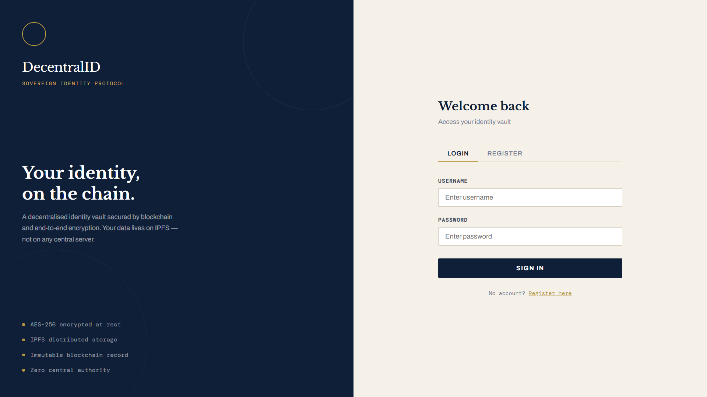
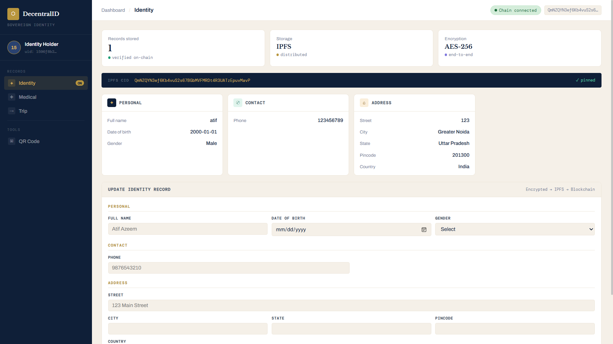
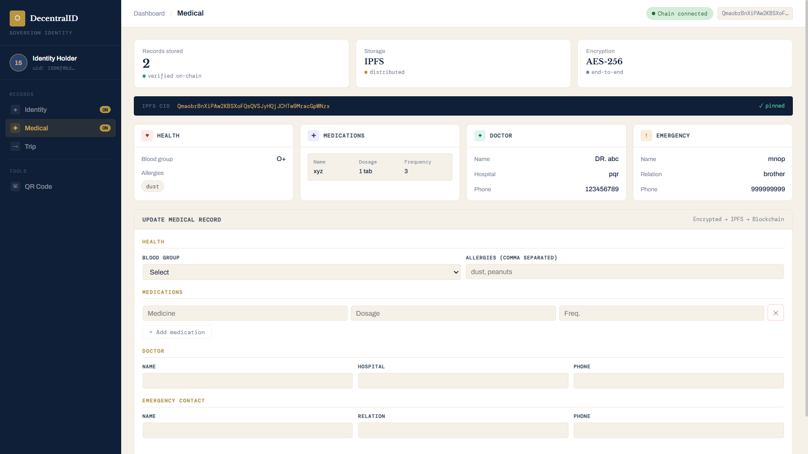
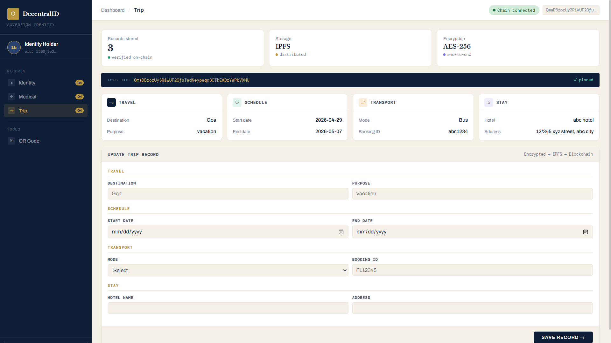
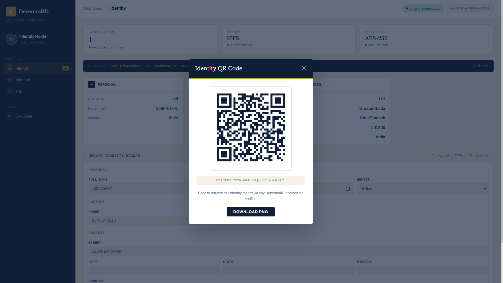
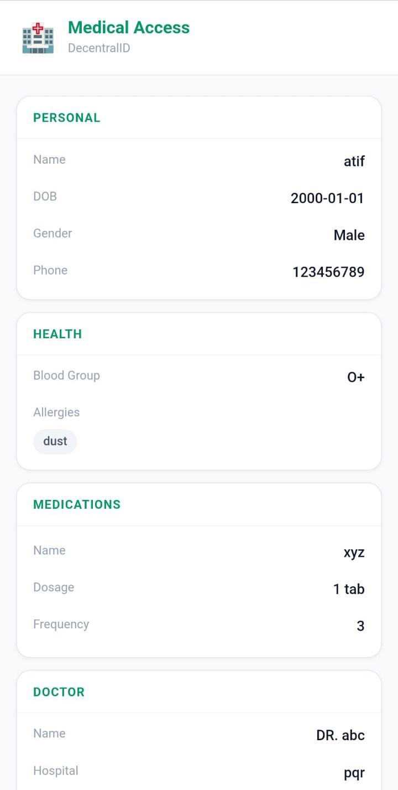
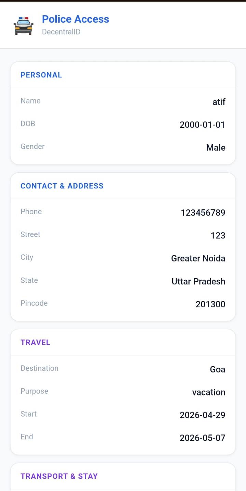

# 🆔 Decentralized Digital Identity System

A blockchain-based digital identity platform that combines Ethereum, IPFS, and AES encryption to provide secure, decentralized storage and retrieval of identity information.

---

## 🚀 What This Is

Traditional digital identity systems are typically centralized, making them vulnerable to data breaches, unauthorized access, and single points of failure.

This project explores a decentralized approach to identity management by combining:

* Ethereum Smart Contracts
* IPFS (InterPlanetary File System)
* AES-256 Encryption
* QR Code Based Identity Retrieval
  
For the purpose of proof of work in this system we have assumed that the data user is providing is authentic. In real word use case data authentication can easily be performed by using aadhar otp verification to retrieve the real data connected to an individual. 

Instead of storing sensitive information directly on the blockchain, encrypted identity records are stored on IPFS while only the corresponding Content Identifier (CID) is stored on-chain.
Identity data can only be fetched through authorized user(In this case for demo two different API calls can retrieve either medical and personal or trip and personal data depending upon wether the backend was called through medical api/police api

---

## ✨ Features

### 🔐 Secure Identity Storage

* Encrypts user data using AES-256
* Stores encrypted records on IPFS
* Stores only IPFS CIDs on Ethereum

### 🏥 Multiple Identity Modules

Supports separate identity categories:

* MAIN (Personal Information)
* MEDICAL (Healthcare Information)
* TRIP (Travel Information)

Each module can be managed independently.

### ⛓️ Blockchain Verification

* Smart contracts deployed on Ethereum Sepolia
* Immutable CID storage
* Version tracking for identity records
* On-chain verification of stored data

### 📱 QR Code Based Retrieval

* Generates a QR code linked to a user's unique ID
* Allows rapid identity lookup
* Useful for healthcare, law enforcement, and emergency scenarios

### 🌐 Decentralized Storage

* Uses IPFS for distributed file storage
* Eliminates reliance on a single storage server
* Provides content-addressable data retrieval

---

## 🏗️ System Architecture

```text
User
  ↓
Frontend (React)
  ↓ DATA
Backend (Node.js + Express)
  ↓
AES-256 Encryption
  ↓
IPFS Storage
  ↓
CID Generation
  ↓
Ethereum Smart Contract
```

### Data Upload Flow

```text
User → Frontend → Backend
      → Encrypt Data
      → Upload to IPFS
      → Generate CID
      → Store CID on Ethereum
```

### Data Retrieval Flow

```text
User → QR/User ID
      → Backend
      → Ethereum
      → Retrieve CID
      → Fetch Data from IPFS
      → Decrypt
      → Return Data
```

---

## ⚙️ Tech Stack

### Frontend

* React
* JavaScript
* HTML
* CSS

### Backend

* Node.js
* Express.js

### Blockchain

* Ethereum Sepolia Testnet
* Solidity
* Ethers.js

### Storage

* IPFS

### Database

* MongoDB

### Security

* AES-256 Encryption

---

---

## 🔧 Smart Contract

The smart contract acts as a registry that stores mappings between:

```text
userId → dataType → CID
```

Stored information includes:

* CID
* Timestamp
* Version Number

Benefits:

* Minimal on-chain storage
* Fast lookups
* Immutable records
* Version tracking

---

## 📸 Screenshots

Add screenshots here:

### Dashboard



### Identity Management





### QR Retrieval


 
 

---

## 🧪 Running Locally

### Prerequisites

* Node.js
* MongoDB
* MetaMask
* IPFS
* Ethereum Sepolia Account

### Install Dependencies

```bash
npm install
```

### Configure Environment Variables

Create a `.env` file:

```env
RPC_URL=
PRIVATE_KEY=
CONTRACT_ADDRESS=
MONGODB_URI=
IPFS_API_KEY=
```

### Start Backend

```bash
npm run server
```

### Start Frontend

```bash
npm start
```

---

## ⚠️ Current Limitations

This project is currently a prototype.

Known limitations include:

* Centralized key management
* Limited access control
* No role-based authorization
* Dependency on third-party IPFS pinning services
* QR codes currently contain only user identifiers

---

## 🔮 Future Improvements

Planned enhancements include:

* Role-Based Access Control (RBAC)
* Wallet-Based Identity Management
* MetaMask Authentication
* Zero-Knowledge Proofs (ZKP)
* Self-Sovereign Identity (SSI)
* Decentralized Key Management
* Government Identity Verification Integration

---
